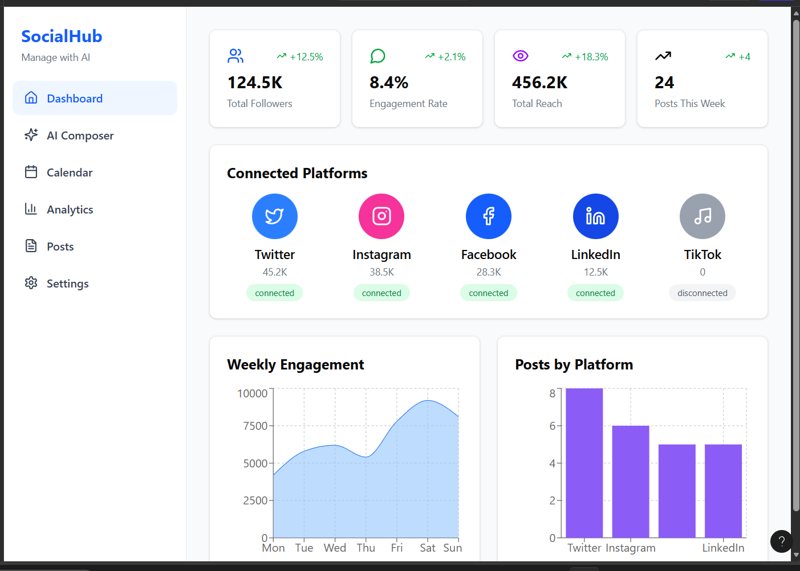

# ACTIVELY WORKING ON THIS PROJECT
* LAST UPDATE FOR TODAY : January 9, 2026 -  11:24 pm 


---
# ⚡ Automated Social Analytics Platform (ASAP) ⚡

# 🚧 ASAP (Automated Social Analytics Platform) - [Active Development]

> **Note to Reviewers:**
> This repository is currently in active development (v0.5).
> The Core Architecture (Next.js + Python) is established, but the
> AI Integration module is currently being refactored for better API efficiency.
>
> **Current Status:**
> ✅ Frontend Dashboard (Next.js) - Functional
> ✅ Database Schema (Supabase) - Linked
> 🔄 AI Parsing Logic - In Progress (Refactoring, and Actively Updating)

**ASAP** is a comprehensive social media management tool designed to help businesses and creators manage multiple platforms from a single dashboard. Built with a modern tech stack, it leverages AI to automate content creation, scheduling, and deep analytics.


## 🚀 Features

### 📊 **Dashboard**
- Unified view of all social media accounts
- Real-time analytics and performance metrics
- Quick access to recent posts and engagement stats

### 🤖 **AI Assistant**
- Powered by Google Gemini AI
- Conversational AI chatbot for content suggestions
- Real-time responses with optimistic UI updates
- Attachment support for context-aware assistance

### 📈 **Analytics**
- Sentiment analysis using VADER
- Performance tracking across platforms
- Engagement metrics and trend analysis
- Comprehensive reporting system
- 

### 📅 **Calendar**
- Visual content scheduling interface
- Drag-and-drop post planning
- Multi-platform scheduling
- Custom event management

### ✍️ **Post Management**
- Create and publish posts across platforms
- Multi-platform support
- Draft saving and scheduling

### ⚙️ **Settings & Account**
- User profile management
- Avatar selection and customization
- Account preferences
- Platform connection management

### 🔐 **Authentication**
- Secure login and registration
- Session management
- Protected routes

---

## 🛠️ Tech Stack

### **Frontend**
- **Next.js 14** - React framework with App Router
- **TypeScript** - Type-safe development
- **Tailwind CSS** - Utility-first styling
- **React Big Calendar** - Event scheduling

### **Backend**
- **Python FastAPI** - High-performance API server
- **Supabase** - PostgreSQL database and authentication
- **Google Gemini AI** - Conversational AI

### **Tools & Libraries**
- **VADER Sentiment Analysis** - NLP for social sentiment
- **Uvicorn** - ASGI server

---

## ✅ Advantages

### **For Users**
- **Single Dashboard Control** - Manage all social media accounts from one place, eliminating platform switching
- **AI-Powered Assistance** - Get intelligent content suggestions and insights using Google Gemini AI
- **Time Savings** - Automate repetitive tasks like scheduling and analytics reporting
- **Data-Driven Decisions** - Sentiment analysis and comprehensive metrics guide your strategy
- **Visual Planning** - Calendar view makes content planning intuitive and organized
- **Real-Time Insights** - Monitor performance across platforms instantly

### **For Developers**
- **Modern Tech Stack** - Built with Next.js 14, TypeScript, and FastAPI for maintainability
- **Type Safety** - TypeScript throughout reduces runtime errors and improves developer experience
- **Scalable Architecture** - Separation of concerns (frontend/backend) allows independent scaling
- **API-First Design** - Clean API layer makes integration and testing straightforward
- **Open Source Potential** - Well-documented codebase ready for collaboration

### **Business Value**
- **Cost Effective** - Self-hosted solution reduces subscription costs from multiple SaaS tools
- **Customizable** - Full control over features and data storage
- **No Vendor Lock-in** - Own your data and infrastructure
- **Competitive Edge** - AI-driven insights help stay ahead of trends

---

## ⚠️ Disadvantages & Limitations

### **Current Technical Limitations**
- **Platform Integrations** - Currently limited; major platforms (Instagram, Twitter, TikTok) not yet integrated
- **No Real-Time Updates** - WebSocket support pending, relies on polling for updates
- **Message History** - AI chat doesn't persist conversation context between sessions(Will further study this)
- **Single User** - No multi-user or team collaboration features yet
- **No Offline Support** - Requires active internet connection for all operations

### **Development & Maintenance**
- **Self-Hosting Required** - Users must manage their own server infrastructure
- **API Rate Limits** - Dependent on third-party APIs (Gemini AI, social platforms) with usage quotas
- **Learning Curve** - Requires technical knowledge to set up and deploy
- **Manual Updates** - No auto-update mechanism; users must manually pull updates
- **Testing Coverage** - Limited automated tests currently implemented

### **Feature Gaps**
- **No Mobile App** - Web-only interface, responsive design but no native mobile app(Soon will be adding this)
- **Limited Analytics** - Basic sentiment analysis; lacks advanced competitor insights
- **No Content Templates** - Users must create posts from scratch
- **Single Language** - English only, no internationalization yet
- **Limited File Support** - Restricted attachment types and sizes(Currently aiming to attach pdf and images)

### **Security Considerations**
- **API Keys in Environment** - Requires careful management of sensitive credentials
- **No 2FA** - Two-factor authentication not yet implemented (Surely study how to do this)
- **Rate Limiting** - Client-side only; needs server-side enforcement
- **Audit Logs** - No comprehensive logging for security monitoring

### **Scalability Concerns**
- **Database Performance** - May need optimization for large-scale deployments (1000+ users)
- **Message Storage** - No pagination or cleanup strategy for old chat messages
- **File Storage** - Attachments stored without compression or CDN integration
- **Concurrent Users** - Not stress-tested for high concurrent load

---

## � Known Issues & Possible Bugs

### **High Priority**
- **🔴 Duplicate Message IDs** - Using `Date.now()` for message IDs can create duplicates if messages are sent rapidly
  - **Impact:** React key warnings, potential UI rendering issues
  - **Workaround:** Wait 1-2 seconds between messages
  - **Fix Planned:** Implement `crypto.randomUUID()` or nanoid library

- **🔴 API Connection Validation** - Invalid `NEXT_PUBLIC_API_URL` doesn't prevent app startup
  - **Impact:** Silent failures, confusing error messages
  - **Workaround:** Manually verify .env.local file
  - **Fix Planned:** Add startup validation checks

- **🔴 Message Optimistic Update Rollback** - Failed API calls don't remove optimistically added messages
  - **Impact:** User sees sent message even if backend failed
  - **Workaround:** Refresh page to see actual state
  - **Fix Planned:** Implement proper error rollback mechanism

### **Medium Priority**
- **🟡 Auto-Scroll Race Condition** - Rapid messages may not scroll to bottom consistently
  - **Impact:** User needs to manually scroll
  - **Workaround:** Click in chat area to trigger scroll
  - **Fix Planned:** Debounce scroll events

- **🟡 No Loading State for Initial Data** - Dashboard shows empty before data loads
  - **Impact:** Poor UX, appears broken momentarily
  - **Workaround:** None
  - **Fix Planned:** Add skeleton loaders

- **🟡 Unhandled API Error Types** - All errors show generic "Try again!" message
  - **Impact:** Users don't know if it's network, auth, or server issue
  - **Workaround:** Check browser console
  - **Fix Planned:** Implement specific error handling

- **🟡 Attachment Button Non-Functional** - Button renders but doesn't handle file selection
  - **Impact:** Feature appears broken
  - **Workaround:** None currently
  - **Fix Planned:** Implement file upload logic

### **Low Priority**
- **🟢 Memory Leak with Long Chat Sessions** - Messages array grows indefinitely
  - **Impact:** Performance degrades after 100+ messages
  - **Workaround:** Refresh page periodically
  - **Fix Planned:** Implement message pagination/virtualization

- **🟢 Inconsistent Indentation** - Mixed spacing in chatBox.tsx
  - **Impact:** Code readability
  - **Workaround:** None needed
  - **Fix Planned:** Run Prettier formatting

- **🟢 No Input Length Validation** - Users can send extremely long messages
  - **Impact:** UI breaks with very long text
  - **Workaround:** Keep messages under 500 characters
  - **Fix Planned:** Add maxLength validation

- **🟢 SVG Icons Repeated** - Inline SVGs duplicated across components
  - **Impact:** Larger bundle size
  - **Workaround:** None needed
  - **Fix Planned:** Extract to icon component library

### **Browser-Specific Issues**
- **Safari:** Backdrop-blur may not render correctly on older versions
- **Firefox:** Auto-scroll behavior slightly different from Chrome
- **Mobile Safari:** Input may lose focus after sending message

### **Reporting Bugs**
If you encounter a bug not listed here:
1. Check the browser console for error messages
2. Open an issue on GitHub with:
   - Description of the problem
   - Steps to reproduce
   - Expected vs actual behavior
   - Browser and OS version
   - Screenshots if applicable

---

## 🚀 Getting Started

### **Prerequisites**
- Node.js 18+ and npm/yarn
- Python 3.9+
- Supabase account (free tier works)
- Google Gemini AI API key

### **Installation**

#### 1. Clone the Repository
```bash
git clone https://github.com/YOUR_USERNAME/Automated-Social-Analytics-Platform.git
cd Automated-Social-Analytics-Platform
```

#### 2. Frontend Setup
```bash
cd client
npm install
# or
yarn install

# Create environment file
cp .env.example .env.local

# Add your environment variables to .env.local:
# NEXT_PUBLIC_API_URL=http://localhost:8000
# NEXT_PUBLIC_SUPABASE_URL=your_supabase_url
# NEXT_PUBLIC_SUPABASE_ANON_KEY=your_supabase_key
```

#### 3. Backend Setup
```bash
cd ../server
python -m venv venv

# Windows
venv\Scripts\activate
# Mac/Linux
source venv/bin/activate

pip install -r requirements.txt

# Create .env file
# Add your API keys:
# GEMINI_API_KEY=your_gemini_key
# SUPABASE_URL=your_supabase_url
# SUPABASE_KEY=your_supabase_key
```

#### 4. Run the Application
```bash
# Terminal 1: Start Backend
cd server
python main.py
# Backend runs on http://localhost:8000

# Terminal 2: Start Frontend
cd client
npm run dev
# Frontend runs on http://localhost:3000
```

---

## 🤝 Contributing & Collaboration

We welcome contributions from developers of all skill levels! Here's how you can get involved:

### **Ways to Contribute**

#### 🐛 **Bug Fixes**
- Check the [Known Issues](#-known-issues--possible-bugs) section
- Fix a bug and submit a PR
- Include tests if possible

#### ✨ **New Features**
- Check the [Roadmap](#-future-updates--roadmap) for planned features
- Propose new features via GitHub Issues
- Discuss implementation approach before starting

#### 📝 **Documentation**
- Improve README clarity
- Add code comments
- Create tutorials or guides
- Fix typos

#### 🧪 **Testing**
- Write unit tests for existing features
- Add integration tests
- Report edge cases

### **Contribution Workflow**

1. **Fork the Repository**
   ```bash
   # Click "Fork" on GitHub, then:
   git clone https://github.com/YOUR_USERNAME/Automated-Social-Analytics-Platform.git
   ```

2. **Create a Feature Branch**
   ```bash
   git checkout -b feature/your-feature-name
   # or
   git checkout -b fix/bug-description
   ```

3. **Make Your Changes**
   - Write clean, documented code
   - Follow existing code style
   - Test your changes locally

4. **Commit with Clear Messages**
   ```bash
   git add .
   git commit -m "feat: add streaming AI responses"
   # or
   git commit -m "fix: resolve duplicate message ID bug"
   ```

5. **Push and Create Pull Request**
   ```bash
   git push origin feature/your-feature-name
   ```
   Then open a Pull Request on GitHub

### **Code Style Guidelines**
- **TypeScript:** Use proper types, avoid `any`
- **Python:** Follow PEP 8 conventions
- **Components:** Keep components small and focused
- **Comments:** Explain "why", not "what"
- **Testing:** Add tests for new features

### **Looking for Collaborators**

We're especially looking for help with:
- 🔐 **Security Experts** - Implement 2FA, audit code
- 🎨 **UI/UX Designers** - Improve interface, create dark mode
- 📱 **Mobile Developers** - Build React Native app
- 🧪 **QA Engineers** - Write comprehensive tests
- 📊 **Data Scientists** - Enhance analytics algorithms
- 🌍 **Translators** - Add internationalization support

### **Communication Channels**
- **GitHub Issues** - Bug reports, feature requests
- **Pull Requests** - Code contributions
- **Discussions** - General questions, ideas

### **Recognition**
Contributors will be:
- Listed in CONTRIBUTORS.md
- Mentioned in release notes
- Given credit in documentation

---

## 📄 License

This project is licensed under the MIT License - see the LICENSE file for details.

---

## �🔮 Future Updates & Roadmap

### 🎯 **Phase 1: Core Enhancements (Q1 2026)**

#### AI Assistant Improvements
- [ ] Streaming responses for real-time word-by-word display
- [ ] Conversation history and context persistence
- [ ] Multi-modal support (image analysis, voice input)
- [ ] Specialized AI functions (caption generation, hashtag suggestions)
- [ ] Rate limiting and usage quotas

#### Analytics Upgrade
- [ ] Real-time analytics dashboard with live updates
- [ ] Advanced sentiment analysis with emotion detection
- [ ] Competitor analysis and benchmarking
- [ ] Export reports to PDF/CSV
- [ ] Custom date range filtering

#### Performance & Scalability
- [ ] Message virtualization for 100+ chat history
- [ ] Request caching with React Query or SWR
- [ ] API retry logic with exponential backoff
- [ ] WebSocket support for real-time notifications
- [ ] Offline mode with request queuing

### 🚀 **Phase 2: Advanced Features (Q2 2026)**

#### Content Creation Suite
- [ ] AI-powered content generator for multiple platforms
- [ ] Image editing and enhancement tools
- [ ] Video thumbnail generator
- [ ] Content calendar templates
- [ ] Bulk scheduling

#### Platform Integrations
- [ ] Twitter/X integration
- [ ] Instagram API connection
- [ ] LinkedIn publishing
- [ ] Facebook Pages management
- [ ] TikTok analytics

#### Automation
- [ ] Auto-posting at optimal times
- [ ] Smart hashtag recommendations
- [ ] Content recycling suggestions
- [ ] Auto-reply to comments
- [ ] Scheduled reports

### 🔧 **Phase 3: Enterprise & Polish (Q3 2026)**

#### Team Collaboration
- [ ] Multi-user workspaces
- [ ] Role-based access control
- [ ] Approval workflows
- [ ] Team activity logs
- [ ] Collaborative post editing

#### Developer Experience
- [ ] Comprehensive unit and integration tests
- [ ] Storybook component library
- [ ] API documentation with Swagger
- [ ] Performance monitoring (Sentry integration)
- [ ] CI/CD pipeline improvements

#### User Experience
- [ ] Dark mode support
- [ ] Mobile responsive design improvements
- [ ] Accessibility (WCAG 2.1 AA compliance)
- [ ] Multi-language support (i18n)
- [ ] Customizable themes

----
### 🛡️ **Ongoing Improvements**

#### Security
- [ ] Two-factor authentication (2FA)
- [ ] API key rotation
- [ ] Rate limiting on all endpoints
- [ ] XSS and CSRF protection
- [ ] Regular security audits


#### Code Quality
- [ ] TypeScript strict mode
- [ ] ESLint and Prettier configuration
- [ ] Pre-commit hooks with Husky
- [ ] Code coverage >80%
- [ ] Performance benchmarks

#### Expected Update Soon 
- CHAT GPT MODEL INTERGARTION

git add .
git commit -m "Updating"
 git push
---

## 📷 Documentation 



## 🎨 Automated Social Analytics Platform (ASAP) Official Logo

 


<div align="center">

### 💡 Philosophy
> *"Creating something out of nothing."*

Last Updated: **January 3, 2026**
# ACTIVELY WORKING ON THIS PROJECT
* LAST UPDATE FOR TODAY : January 9, 2026 -  11:24 pm 

---
</div>
